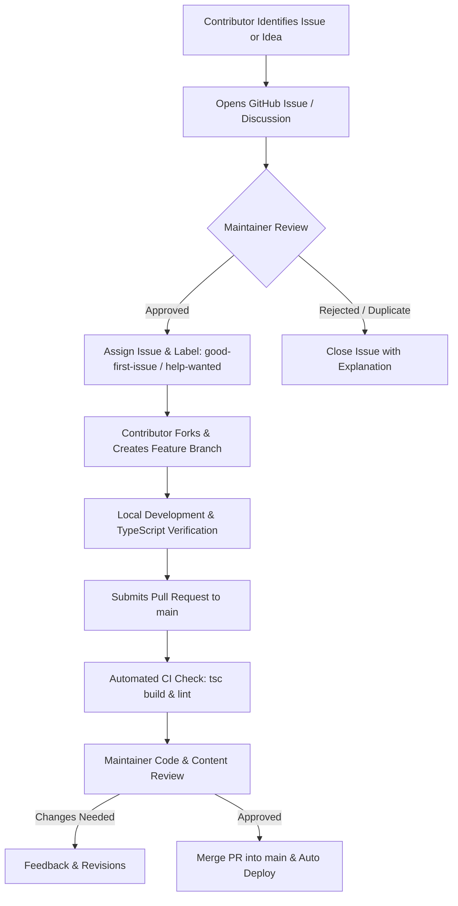

# GotiPrep — Open Source Contribution Plan & Governance Procedure

> **Note**: This document is stored in the local `documentations/` directory (excluded from public GitHub commits via `.gitignore`) to serve as an internal maintainer playbook and community governance strategy document.

---

## 🎯 Executive Summary & Objectives

The goal of opening GotiPrep to open-source contributions is to:
1. **Accelerate Content Expansion**: Crowd-source exam-accurate passages for TCS NQT, IBPS, RBI, SSC CGL/CHSL, and State Government typing exams.
2. **Drive Product Quality**: Enable frontend developers to contribute UI components, accessibility improvements, theme polishes, and localized features.
3. **Build Community Trust**: Provide transparent assessment logic (WPM, Net/Gross accuracy, time calculations, anti-cheat detection) so aspirants can trust test results.

---

## 📋 Open Source Maintenance & Contribution Workflow

---

## 🏷️ Issue Management & Labeling System

Maintainers should categorize issues using standard GitHub labels:

| Label | Description | Audience |
|---|---|---|
| `good-first-issue` | Simple task ideal for first-time open source contributors | Beginners |
| `help-wanted` | Tasks requiring community help or domain knowledge | General Contributors |
| `exam-content` | Adding or verifying exam passages, Cloze sentences, or Email prompts | Educators & Content Writers |
| `bug` | Software defects or calculation errors | Developers |
| `enhancement` | New feature proposals or UI refinements | Developers & Designers |
| `documentation` | Improvements to guides, inline JSDoc, or markdown docs | All |

---

## 🔍 Pull Request (PR) Quality Control Procedure

### 1. Code Standards
- **TypeScript Strictness**: All files must compile with zero errors via `npx tsc --noEmit`.
- **Styling**: Component styles must respect CSS variables defined in `index.css` (supporting dark mode and `#F8EEEE` light mode).
- **Anti-Pattern Prevention**: No hardcoded static pixel heights for text containers or swallowing exceptions silently.

### 2. Content Standards (Exam Passages & Questions)
- Passages added to `typingPassages.ts` or `passages.ts` must be free of grammatical errors and verified for authentic exam difficulty.
- 2-Mark MCQs must include detailed explanation breakdowns justifying the correct option.

### 3. Review SLA
- Initial feedback on issues/PRs within **48 hours**.
- Merging releases on a bi-weekly cadence.

---

## 🛡️ Security & Privacy Procedure

- **No API Keys in Repository**: Ensure no secret keys or database URI credentials are committed.
- **Client-Side Data Isolation**: Personal bests and user performance remain in browser `localStorage`.
- **Security Escalations**: Process vulnerabilities submitted to `SECURITY.md` in private within 48 hours.
